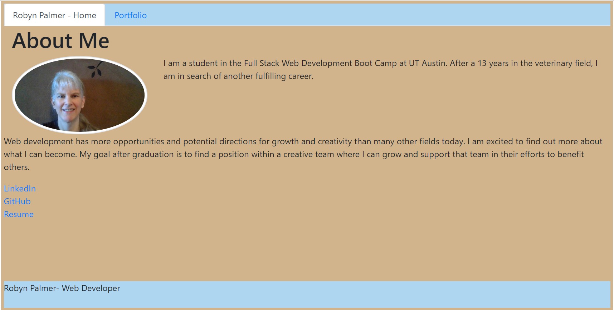
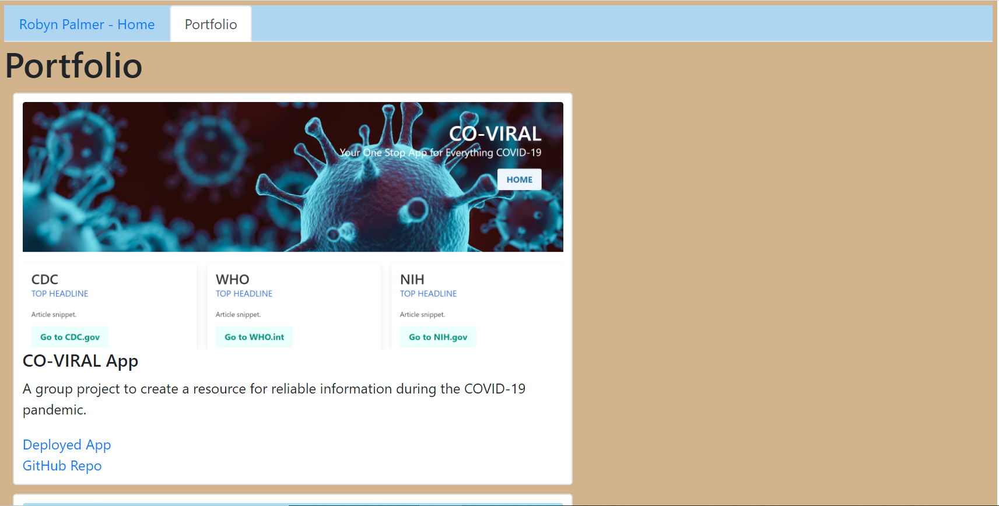

# Homework20 React Portfolio

For this assignment, I refactored my previous portfolio to use React.  The site contains:
* an About Me page with my brief story and goals
* a Portfolio page showing items I created in this course, plus an outside interest

## Requirements Completed

* Functional, deployed application

* GitHub repository with README describing the project

* Navtabs consistent on each page, with links to Home/About and Portfolio pages

* Footer consistent on each page

* Cards for each featured project created with a single React component

## Deployed URL

https://robynp108.github.io/20ReactPortfolio/

## Page Screenshots

### Home

### Portfolio

